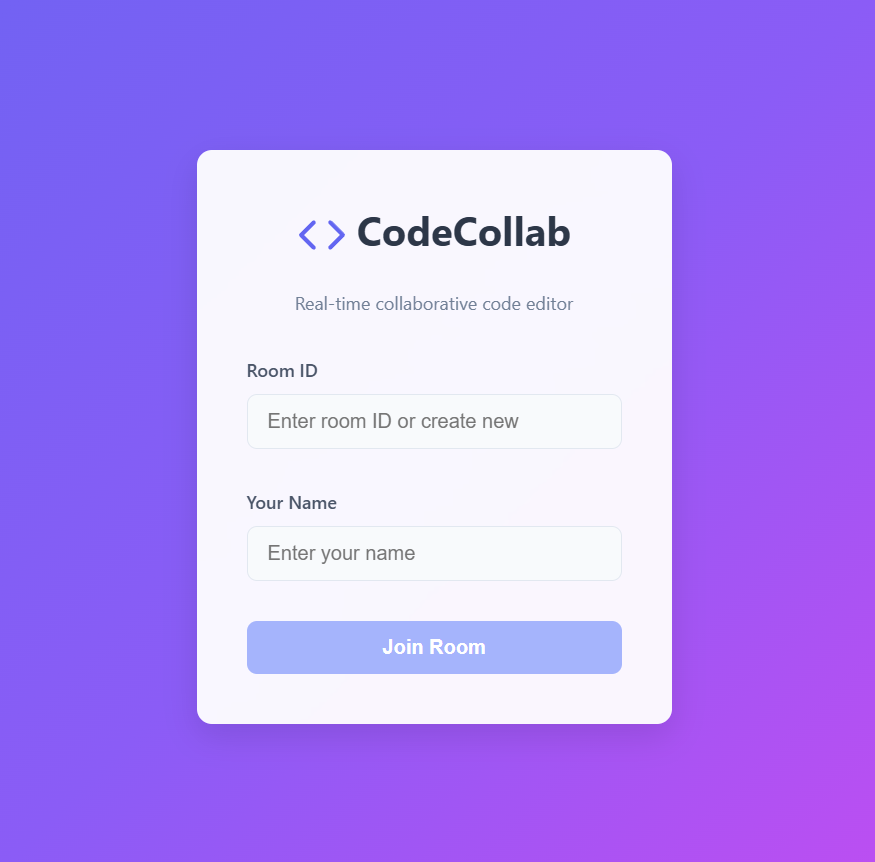
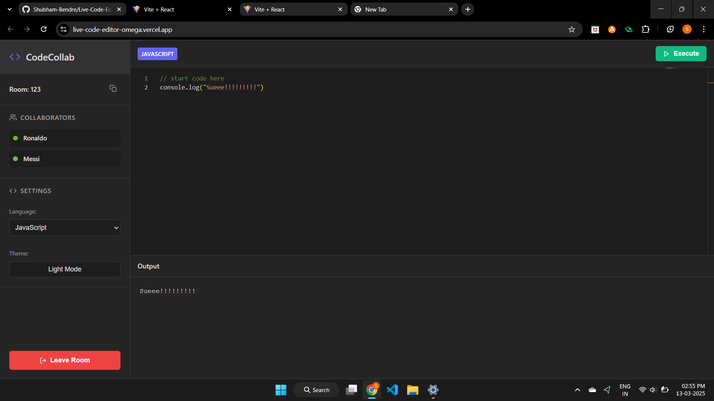
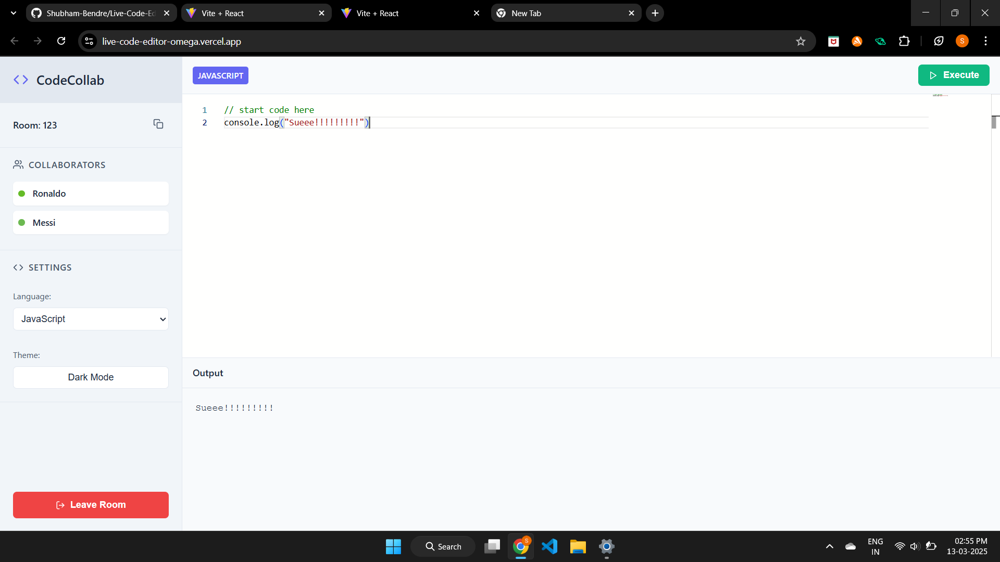

# 💻 Live Code Editor

Welcome to **Live Code Editor** – a real-time collaborative coding playground where multiple users can join, write, and compile code together. With seamless synchronization and multi-language support, coding with your peers has never been easier!

---

## 🌟 Features

- **Real-time Collaboration:** 👥 Multiple users can join the same room and code together in sync.
- **Live Code Compilation:** 🚀 Instantly compile and execute code within the editor.
- **Multi-Language Support:** 🛠️ Choose from multiple programming languages to code in.
- **Dark & Light Mode:** 🌙☀️ Toggle between dark and light themes for a better coding experience.
- **Cursor Position Tracking:** 🎯 See where other users are typing in real time.
- **Typing Indicator:** ✍️ Know when someone else is typing.
- **Seamless Room Management:** 🔗 Join or leave rooms dynamically without refreshing the page.

---

## 🚀 Tech Stack

- **Frontend:** HTML, CSS, JavaScript
- **Backend:** Node.js, Express.js, Socket.io
- **Code Execution API:** [Piston API](https://emkc.org/api/v2/piston)

---

## 📸 Screenshots

### 1️⃣ Landing Page


### 2️⃣ Dark Mode


### 3️⃣ Light Mode


---

## 🕹️ **Installation & Setup**  

1. **Clone the repository:**  
   ```bash
   git clone https://github.com/your-username/live-code-editor.git
   cd live-code-editor
   ```

2. **Install dependencies:**  
   ```bash
   npm install
   ```

3. **Start the server:**  
   ```bash
   npm start
   ```

4. **Open in Browser:**  
   ```
   http://localhost:5000
   ```

---

## ✨ Future Enhancements

- **User Authentication:** 🔑 Allow users to create accounts and save code snippets.
- **Code History & Versioning:** 📜 Track changes and restore previous versions.
- **Integrated AI Code Assistance:** 🤖 Suggest code improvements in real-time.
---
💡 **Want to contribute?** Feel free to fork this repo, improve the models, or add new features! 🚀

